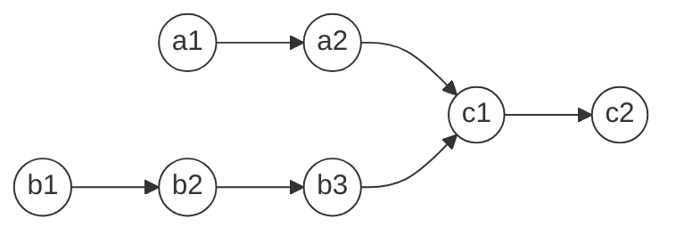

# 链表

链表相关的问题基本都是双指针解决的，其中快慢指针常用于判断链表是否成环。

## 合并、分隔链表

### 合并两个有序链表 ( 21 )

将两个有序链表合并为一个新的升序链表并返回。

这个问题比较简单，类似归并排序的 merge 操作，用两个指针，值小的节点先合并，直到其中一条链表为空，将剩余的节点直接拼接到新链表上。

```javascript
function mergeTwoLists(list1, list2) {
  const dummy = new ListNode(null) // 虚拟头结点
  let p = dummy

  while(list1 && list2) {
    if (list1.val < list2.val) {
      p.next = list1
      list1 = list1.next
    } else {
      p.next = list2
      list2 = list2.next
    }
    p = p.next
  }
  // 当其中一条链表检查完，拼接另一条（可能也为空）
  p.next = list1 ? list1 : list2
  return dummy.next
}
```

代码中用到了链表算法题中常见的虚拟头结点 ( dummy ) 技巧，有了 dummy 节点作为占位符，可以避免出现空指针。

**每当你需要创建一条新链表时，建议都使用 dummy 节点，可以减少很多麻烦。**

### 合并 k 个有序链表 ( 23 )

这是面试常考题。整体思路与“合并两个有序链表”是一样的，问题在于，如何快速找到 k 个链表的最小节点，答案是**优先级队列 ( 最小堆 )**。

```javascript
function mergeKLists(lists) {
  if (lists.length === 0)
    return null

  // 优先级队列， 值越小，优先级越高
  const pq = new PriorityQueue((a, b) => a.val - b.val)
  // 将 k 个链表的头结点加入队列
  for(let list of lists) {
    list && qp.add(list)
  }

  const dummy = new ListNode()
  let p = dummy

  while(!pq.isEmpty()) {
    const min = pq.pop() // k 个链表的最小节点
    min.next && pq.add(min.next) // 持续将链表节点推入队列

    p.next = min
    p = p.next
  }

  return dummy.next
}
```

优先队列中元素的个数最多有 k 个，每次优先队列添加或删除节点的时间复杂度为 $O(logk)$，链表中的每个节点都会加入和弹出队列。因此，整个算法的时间复杂度为 $O(nlogk)$。

### 分隔链表 ( 86 )

给定一个链表和特定值 x，分隔链表使得小于 x 的节点都在左边，大于等于 x 的在右边。

上一题是归并排序的 merge 操作，这一题是快速排序的 partition 操作。

```javascript
function partition(head, x) {
  const dummy1 = new ListNode(null, null)
  const dummy2 = new ListNode(null, null)
  let p = head, p1 = dummy1, p2 = dummy2

  while(p) {
    if (p.val < x) {
      p1.next = p
      p1 = p1.next
    } else {
      p2.next = p
      p2 = p2.next
    }
    // 断开原链表的连接
    let temp = p.next
    p.next = null
    p = temp
  }
  l1.next = dummy2.next // 连接两个子链表

  return dummy1.next
}
```

这道题中虚拟头结点的作用就很明显了，没有虚拟头结点，就需要各种空指针的判断，代码会复杂很多。

## 链表的第 k 节点

### 倒数第 k 个

假设一个链表有 n 个节点，那么倒数第 k 节点就是顺数第 `n - k + 1` 节点。然而，链表的长度通常是未知的，我们需要先遍历一遍链表得到 n，再遍历 `n - k + 1` 次找到倒数第 k 个节点。

上述做法需要遍历两次，用双指针技巧只需遍历一次。

1. 左指针不动，右指针往前走 k 步，左右指针形成长度为 k + 1 的区间
2. 左右指针同时移动，直到右指针到达尾部 null 节点，左指针正好是倒数第 k 个节点


实现代码如下：

```javascript
function findFromEnd(head, k) {
  let l = head, r = head
  for(let i = 0; i < k; i++) {
    r = r.next
  }
  while(r !== null) {
    l = l.next
    r = r.next
  }
  return l
}
```

### 删除倒数第 k 个 ( 19 )

有了上述 `findFromEnd` 函数后，要删除倒数第 k 个节点就比较容易了，只需找到倒数第 k + 1 个节点，然后删除下一个节点即可。

```javascript
function removeNthFromEnd(head, k) {
  const dummy = new ListNode(null, head)

  // 删除倒数第 k 个，需要找到倒数第 k + 1 个节点
  const prev = findFromEnd(dummy, k + 1)
  prev.next = prev.next.next // 删除节点

  return dummy.next
}
```

代码中虚拟头结点也是为了防止出现空指针。假如要删除的是第 1 个节点，那么它的前一个节点是不存在的，虚拟头结点可以解决这个问题。

## 链表的快慢指针

### 链表的中点 ( 876 )

在不知道链表长度的情况下，要找出链表的中间节点，需要用到快慢指针。

1. slow、fast 指针指向头结点 head
2. slow 每次前进 1 步，fast 每次前进 2 步
3. 当 fast 到达尾部 null 节点，slow 则指向中间节点

```javascript
function middleNode(head) {
  let slow = head, fast = head
  while(fast !== null && fast.next !== null) {
    slow = slow.next
    fast = fast.next.next
  }
  return slow
}
```

需要注意的是，如果链表长度为偶数，说明有两个中间节点，快慢指针算法得到的是后一个中间节点。

### 判断链表是否包含环

快慢指针对判断链表是否成环非常有用。

* 如果链表没有环，fast 到达尾部时，slow 会指向中点
* 如果链表含有环，slow、fast 指针最终会相遇

```javascript
function hasCycle(head) {
  let slow = head, fast = head
  while(fast !== null && fast.next == null) {
    slow = slow.next
    fast = fast.next.next

    if (slow === fast) { // 两指针相遇
      return true
    }
  }
  return false // fast 能到达尾部，说明没有环
}
```

### 链表环的起点

算法思路：当快慢指针相遇时，让 slow 或 fast 指针指向头结点，然后 slow、fast 同速前进，再次相遇的位置就是环的起点。

算法原理：

1. 假设双指针第一次相遇时，slow 走了 k 步，fast 则走了 2k 步


2. 设相遇点距离环起点距离为 m，由 slow 只走了 k 步，可推出 head 到环起点的距离为 `k - m`


3. fast 第一次经过相遇点时已走了 k 步 ( slow 未赶到 )，再走 k 步会再次到达相遇点 ( slow 赶到 )。因此，fast 在相遇点再走 k - m 步会到达环起点

4. 结合第 2 第 3 点可知，将 slow 或 fast 重新指向 head，两个指针同步前进，`k - m` 步后一定会在环起始点相遇

```javascript
function detectCycle(head) {
  let slow = head, fast = head

  while(fast !== null && fast.next !== null) {
    slow = slow.next
    fast = fast.next.next
    if (slow === fast) break
  }

  if (slow === null || fast === null) { // 没有坏
    return null
  }

  slow = head // 其中一个指针重新走

  while(slow ！== fast) {
    slow = slow.next
    fast = fast.next
  }
  return slow
}
```

顺便说一句，fast 比 slow 多走的 k 步其实是 fast 在环内转圈，所以 k 是环长度的整数倍。

总结一下，快慢指针第一次相遇说明有环，同速前进相遇找到环起点。

以上做法的证明比较麻烦，我们可以借助额外空间使这个问题变简单。

我们用一个集合保存所有访问过的节点，当出现访问过的节点，这个节点就是起点。

```javascript
function detectCycle(head) {
  const visited = new Set()

  while(head !== null) {
    if (visited.has(head)) {
      return head
    }
    visited.add(head)
    head = head.next
  }

  return null
}
```

## 相交链表 ( 160 )

给定两个链表的头结点 headA 和 headB，如果两个链表相交，返回相交节点，不相交则返回 null。

比如下面的两个链表相交于 c1 节点。



如果使用常见的双指针技巧，p1 和 p2 两个指针分别在两条链表上前进，并不能同时走到公共节点。

解决这个问题的关键在于：通过某种方式，让 p1、p2 同时到达相交节点。

我们让 p1 遍历完链表 A 后开始遍历链表 B，p2 遍历完链表 B 后开始遍历链表 A。

其实这样相当于将两条链表首尾连在一起，这样它们的长度就一样了，最终它们会在相交点相遇。

```javascript
function getIntersectionNode(headA, headB) {
  let p1 = headA, p2 = headB
  while(p1 !== P2) {
		p1 = p1 === null
      ? headB // p1 到达末尾，转到 B 链表
    	: p1.next
		p2 = p2 === null
      ? headA // p2 到达末尾，转到 A 链表
    	: p2.next
  }
  return p1
}
```

这种做法时间复杂度为 $O(n)$，空间复杂度 $O(1)$。

另一种解法是将两条链表首尾相连，如果两条链表不相交，它们会形成一条单链表，快慢指针会很快结束；如果两条链表相交，则会形成一个环，这就回到了前面寻找环起点的问题。

还有一种思路是：先计算两条链表的长度，然后让它们右对齐，即长的先遍历，直到长度相同，然后同时前进，如果它们相交，则会同时到达相交点。
