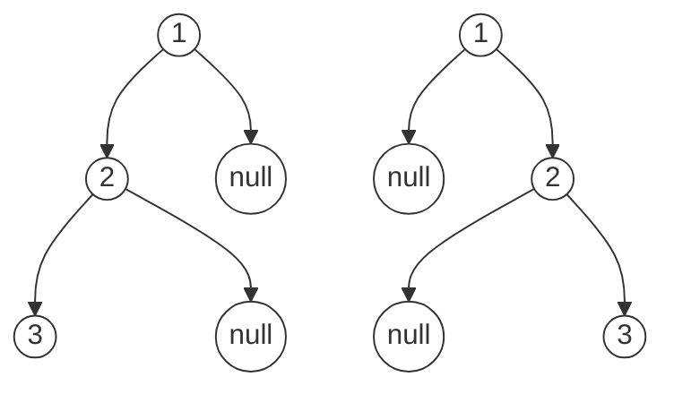

# 二叉树构造

二叉树的构造问题一般使用分解问题的思路：构造整棵树 = 根节点 + 构造左子树 + 构造右子树。

## 构造最大二叉树 ( 654 )

给定不含重复元素的数组，构造一颗最大二叉树。最大二叉树的根是数组的最大元素，最大值的左右部分分别构成左右子树。

```javascript
function build(nums, lo, hi) {
  if (lo > hi) return null // base case

  // 找到最大值的索引
  const index = getMaxIndex(nums, lo, hi)
  const root = new TreeNode(nums[index])
  root.left = build(nums, lo, index - 1)
  root.right = build(nums, index + 1, hi)

  return root
}
function constructMaximumBinaryTree(nums) {
  return build(nums, 0, nums.length - 1)
}
```

整体思路很简单，先找到最大值索引 p，`nums[p]` 构成根节点，p 左边递归构造左子树，右边递归构造右子树。

## 前中序构造 ( 105 )

根据一棵树的前序遍历和中序遍历构建二叉树。比如：

```
preorder = [3,9,20,15,7]
inorder = [9,3,15,20,7]
  3
 / \
9  20
  /  \
 15   7
```

* 前序遍历第一个节点是根节点
* 根节点将中序遍历数组分成左右子树

所以，整体思路就是在中序遍历中找到根节点，然后递归调用根节点的左边和右边。


代码大概如下：

```javascript
function build(preorder, preS, preE, inorder, inS, inE) {
  const rootVal = preorder[0] // 根节点值
  const index = /* 在 inorder 中找到根节点的位置 */

  const root = new TreeNode(rootVal)
  root.left = build(preorder, ?, ?, inorder, ?, ?)
  root.right = build(preorder, ?, ?, inorder, ?, ?)

  return root
}
```

其中主要问题在于递归调用时，preorder 和 inorder 的索引范围。

inorder 的索引范围也比较容易看出来。

```javascript
root.left = build(
  preorder, ?, ?,
  inorder, inS, index - 1)
root.right = build(
  preorder, ?, ?,
  inorder, index + 1, inE)
```

preorder 可以根据左子树的长度计算。设左子树的节点数为 `leftSize`，则 `preorder` 的索引情况是这样的：


根据上图不难写出 preorder 的索引范围。

```javascript
const leftSize = index - inS

root.left = build(
  preorder, preS + 1, preS + leftSize,
  inorder, inS, index - 1)
root.right = build(
  preorder, preS + leftSize + 1, preE,
  inorder, index + 1, inE)
```

在 inorder 中寻找 rootVal 时，为了防止多次循环，不妨用一个 hashMap 将 inorder 中的值和索引映射起来，方便查找。

再加上一些基础判断，最终代码如下：

```javascript
const val2Idx = new Map() // 存储 inorder 值与索引的映射

function build(preorder, preS, preE, inorder, inS, inE) {
  if (preS > preE) { return null } // base case

  const rootVal = preorder[0] // preorder 根节点
  const index = val2Idx.get(rootVal) // inorder 根节点

  const root = new TreeNode(rootVal)
  const leftSize = index - inS // 左子树节点数
  root.left = build(preorder, preS + 1, preS + leftSize,
                    inorder, inS, index - 1)
	root.right = build(preorder, preS + leftSize + 1, preE,
                     inorder, index + 1, inE)
  return root
}
function buildTree(preorder, inorder) {
  for(let i = 0; i < inorder.length; i++) {
    val2Idc.set(inorder[i], i)
  }
  return build(
    preorder,
    0, preorder.length - 1,
    0, inorder.length - 1
  )
}
```

虽然代码看起来有点多，主要是 preorder 和 inorder 的索引参数，画图就清楚了。

## 后中序构造 ( 106 )

后中序列构造与前中序列构造是非常类似的。都是先找根节点，然后在 inorder 和另外一个序列中找出左右子树边界，然后递归构造。

区别在于：

* 前序遍历第一个元素是根节点，后序遍历则是最后一个元素
* preorder 或 postorder 的索引范围不同

postorder 也是通过 leftSize 判断范围的，具体如下图。


核心部分代码如下：

```javascript
const rootVal = postorder[postE]
const root = new TreeNode(rootVal)
const leftSize = index - inS

root.left = build(inorder, inS, index - 1
                  postorder, postS, posS + leftSize - 1)
root.right = build(inorder, index + 1, inE
                  postorder, postS + leftSize, posE - 1)
```

## 前后序构造 ( 889 )

通过前中序、后中序遍历结果可以确定唯一二叉树，但是前后序遍历则无法确定。

比如以下前后序列可以构造成两种树，我们构造任意一种即可。

```
preorder = [1,2,3]
postorder = [3,2,1]
```



前后序列构造二叉树，逻辑上和前两种差别不大，也是通过控制左右子树的索引来构建的。

1. 首先确定根节点，前序的首元素或后序的末元素都是根节点
2. 前序列的第二个元素作为左子树的根节点
3. 在后序列中寻找左子树根节点的值，从而确定左子树的索引边界，进而确定右子树的边界，然后递归构造左右子树


```javascript
function build(pre, preS, preE, post, postS, postE) {
  if (preS > preE) return null
  if (preS === preE) return new TreeNode(pre[preS])

  const rootVal = pre[preS]
  const lRootVal = pre[preS + 1] // 左子树根节点

  const index = val2Idx.get(lRootVal)
  const leftSize = index - postS + 1

  const root = new TreeNode(rootVal)
  root.left = build(pre, preS + 1, preS + leftSize,
                    post, postS, index)
  root.right = build(pre, pre + leftSize + 1, preE,
                     post, index + 1, postE - 1)
  return root
}
```

前后序遍历则无法确定唯一二叉树，我们选择其中一种构造。这体现在代码的这一行：

```javascript
const lRootVal = pre[preS + 1] // 左子树根节点
```

这里我们假设了前序遍历的第二个元素是左子树根节点。实际上左子树有可能是空指针，第二个元素就应该是右子树根节点。

正是因为如此，根据前后序遍历构造二叉树才会有不同结果。

## 序列化与反序列化

### 总结

* 如果序列化结果中不包含空指针信息，需要至少两种序列化结果才能确定一棵二叉树
* 如果不包含空指针信息，但提供两种序列化结果
  * 前序 + 中序，可以确定二叉树
  * 后序 + 中序，可以确定二叉树
  * 前序 + 后序，不能确定二叉树
* 如果包含空指针信息，且只提供一种序列化结果
  * 前序，可以确定二叉树
  * 后序，可以确定二叉树
  * 中序，不能确定二叉树
