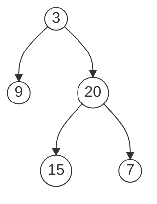
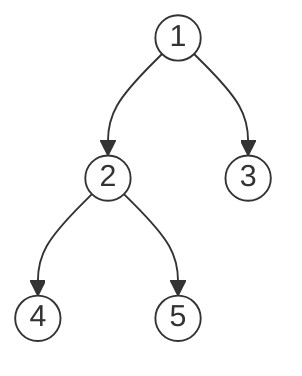

# 二叉树

二叉树遍历框架：

```javascript
function traverse(root) {
  if (root === null) return

  // 前序位置
  traverse(root.left)
  // 中序位置
  traverse(root.right)
  // 后序位置
}
```

`traverse` 就是一个能够访问二叉树所有节点的函数，和遍历数组、链表没有本质区别，**二叉树其实就是二叉链表**。

事实上，只要是递归形式的遍历，都可以有前序位置和后序位置，分别在递归之前和递归之后。

```javascript
function traverse(head) { // 递归遍历单链表
  if (head === null) return
  // 前序位置
  traverse(head.next)
  // 后序位置
}
```

## 前中后序

前中后序是指二叉树遍历过程中处理每个节点的三个特殊时间点，这三个位置的代码**执行时机不同**。

* 前序位置代码：刚进入节点时执行

* 后序位置代码：将要离开节点时执行

* 中序位置代码：左子树都遍历完，即将开始遍历右子树时执行


**解决二叉树的所有问题，就是在前中后序位置注入代码逻辑**。你只需要单独思考每一个节点应该做什么，其他的不用管，递归会在所有节点上执行相同的操作。

## 两种解题思路

二叉树的最大深度 ( 104 ) ：求根节点到最远叶子节点的最长路径上的节点数。比如下图中二叉树的最大深度为 3。



以这题为例，介绍两种二叉树的解题思路。

### 遍历

遍历思路：用 `traverse` 函数遍历二叉树，用外部变量记录每个节点当前的深度，遇到叶子结点，说明已到达当前路径最大深度。

```javascript
let maxDepth = 0, depth = 0
function traverse(root) {
  if (root === null) return

  depth++ // 前序位置
  if (!root.left && !root.right) { // 叶子结点
    maxDepth = Math.max(maxDepth, depth)
  }

  traverse(root.left)
  traverse(root.right)
  depth-- // 后序位置
}
function maxDepth(root) {
  traverse(root)
  return maxDepth
}
```

前序位置代码是 `depth++`，后序位置代码是 `depth--`。当访问到一个新节点时，深度是增加的，离开这个节点时，深度是减小的。这符合上面我们介绍的三种代码执行时机。

### 分解问题

一棵树的最大深度可以通过子树的最大深度推导出来，即 `depth = max(lDepth, rDepth) + 1`。

这样一来，整棵树的问题分解成了子树最大深度的问题。

```javascript
function maxDepth(root) {
  if (root === null) {
    return 0
  }
  const left = maxDepth(root.left)
  const right = maxDepth(root.right)

  // 后序位置
  return 1 + Math.max(left, right)
}
```

和遍历解法不同，分解问题解法的主要逻辑在后序位置，这是因为我们左右子树需要先计算完成。凡是依赖子树解的问题，都是在后序位置操作，后面一节会介绍。

### 两种思路的异同

* 相同点

  两种做法都需要通过递归遍历每个节点，且都逃不出前中后序位置。

* 不同点
  * 第一种是在遍历过程中，**操作外部变量做记录**
  * 第二种是将问题分解成子问题，最主要的是，**递归函数的返回值就是问题或子问题的解**。

下面用二叉树的先序遍历序列对比一下两种思路。

```javascript
function preorder(root) {
  let res = [] // 外部变量

  function traverse(root) {
    if (root === null) return

    res.push(root.val) // 外部变量记录，前序位置
    traverse(root.left)
    traverse(root.right)
  }

  traverse(root) // 遍历
  return res
}
```

```javascript
function preorder(root) {
  if (root === null) {
    return [] // 返回值就是子问题的解
  }

  let left = preorder(root.left)
  let right = preorder(root.right)

  return [root.val, ...left, ...right]
}
```

## 后序位置的特殊性

前序位置本身并不特别，只是我们习惯把前中后序位置不敏感的代码写在前序位置。

中序位置主要用在 BST 中，BST 的中序遍历就是遍历有序数组。

思考一下遍历过程可以发现，前序位置的代码执行是自顶向下的，而后序位置的代码是自底向上的。

这意味着前序位置只能从函数参数中获取父节点传递来的数据，而后序位置除了参数，还能获取子树的函数返回值。

来对比两个小问题：

* 获取每一个节点所在的层数

  ```javascript
  function traverse(root, level) {
    if (root === null) return

    console.log(level) // 前序，只能得到 root.val 和 level
    traverse(root.left, level + 1)
    traverse(root.right, level + 1)
  }
  traverse(root, 1) // 将当前层级传给子级
  ```


* 计算每个节点的左右子树的节点数

  ```javascript
  function count(root) {
    if (root === null) return 0

    let left = count(root.left)
    let right = count(root.right)

    console.log(left, right) // 后序，左右子树已经计算完成
    return left + right + 1
  }
  ```

这两个问题的区别在于：节点在第几层，你从根节点遍历过来的过程就能顺带记录；而树有多少个节点，你需要遍历完左右子树之后才能数清楚。

**能获取子树的信息，这就是后序位置的特殊之处**。

换句话说，一旦题目和子树有关，那大概率要给函数设置合理的定义和返回值，在后序位置写代码。

来看以下后序位置在实际题目中的应用。

### 二叉树的直径 ( 543 )

计算二叉树的直径长度。直径长度是指：任意两个结点路径长度中的最大值。这条路径可能穿过也可能不穿过根结点。



上图的直径长度是 3，路径为  `[4,2,1,3],[5,2,1,3]` 这两种。

这题的关键在于，**每一条直径长度，就是一个节点的左右子树的最大深度之和**。

```javascript
function diameterOfBinaryTree(root) {
  let maxDiameter = 0
	function maxDepth(root) {
    if (root === null) return 0
    let l = maxDepth(root.left)
    let r = maxDepth(root.right)

    // 后序位置，计算最大深度，顺便计算最大直径
    maxDiameter = Math.max(l + r, maxDiameter)
    return Math.max(l, r) + 1
  }
}
```

## 层序遍历

二叉树题型主要是用来培养递归思维的，层序遍历则属于迭代遍历。

层序遍历的代码框架：

```javascript
function levelTraverse(root) {
  if (root === null) return
  const q = new Queue().push(root)

  while(!q.isEmpty()) { // 从上到下遍历二叉树的每一层
    let size = q.size()
    for (let i = 0; i < size; i++) { // 从左到右遍历当前一层节点
      const cur = q.pop()
      cur.left && q.push(cur.left)
      cur.right && q.push(cur.right)

      console.log(cur.val) // 访问当前节点
    }
  }
}
```

while 循环表示从上到下、for 循环表示从左到右遍历节点：


## 二叉树的重要性

二叉树思想的运用非常广泛，可以说，**只要涉及递归，都可以抽象成二叉树的问题**。

比如快速排序，其实它是二叉树的前序遍历。

```javascript
function quickSort(nums, lo, hi) {
  // 前序位置
  let p = partition(nums, lo, hi)

  quickSort(nums, lo, p - 1)
  quickSort(nums, p + 1, hi)
}
```

又比如归并排序，它其实是二叉树的后序遍历。

```javascript
function mergeSort(nums, lo, hi) {
  let mid = Math.floor((lo + hi) / 2)
  mergeSort(nums, lo, mid)
  mergeSort(nums, mid + 1, hi)

  // 后序位置
  merge(nums, lo, mid, hi)
}
```

## 总结

```javascript
function traverse(root) {
  if (root === null) return

  // 前序位置
  traverse(root.left)
  // 中序位置
  traverse(root.right)
  // 后序位置
}
```

前中后序是指二叉树遍历过程中处理每个节点的三个特殊时间点。

后序位置比较特殊，它可以通过函数的返回值获取子树的信息，这可以用来解决很多问题。

二叉树解题的思维模式有两种：遍历、分解问题

* 遍历：**是否可以遍历一次二叉树得到答案？**

  如果可以，用一个 `traverse` 函数配合外部变量来实现

* 分解问题：**是否可以定义一个递归函数，通过子问题（子树）的答案推导出原问题的答案？**

  如果可以，写出这个递归函数的定义，并充分利用函数的返回值

无论使用哪种思维模式，你都需要思考：

**单独抽出一个二叉树节点，它需要做什么事情？需要在什么时候（前/中/后序位置）做**？其他的节点不用操心，递归函数会帮你在所有节点上执行相同的操作。
