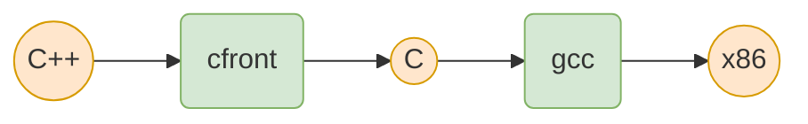
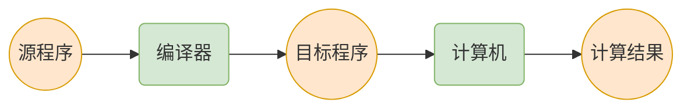

# 编译器介绍

## 概述

**编译器是一个程序，核心功能是把源代码翻译成目标代码。**

源代码指**高级语言**代码，目标代码通常指的是各种架构机器下运行的**汇编**、**字节码**或**二进制代码**。比如：

* 源代码：`C / C++`、`Java`、`C#`、`Python`

* 目标代码：`x86`、`IA64`、`ARM`、`MIPS`

**目标代码可以是另一种高级语言代码**。比如`cfront编译器`的目标代码是`C语言`，它可以把`C++`代码翻译成`C`代码。



编译计算整体流程：



### 解释器

与编译器类似，解释器也是处理程序的一种**程序**。

* 源程序经编译器处理后，得到**可执行程序**，可保存在磁盘中重复执行
* 源程序经解释器处理后，直接得到**计算结果**

因此可以说，编译器是**离线（*offline*）**模式，解释器是**在线（*online*）模式**。

## 编译器结构

**编译器是由多个阶段（*phase*）构成的“流水线”结构。**


* 编译器由多个阶段组成，每个阶段处理不同的问题。为此，需要使用不同的理论、数据结构和算法
* 编译器设计的重要问题是如何合理的划分组织各个阶段。需要做到**接口清晰**、**容易实现和维护**

## 一个简单编译器例子

* 源语言：加法表达式语言`Sum`

  * 整型数字： `n`
  * 加法：`e1 + e2`，比如`1`、`1 + 2`、`1 + 2 + 3`

* 目标机器：栈式计算机`Stack`

  * 一个操作数栈

  * 压栈指令`push n`：将`n`压栈
  * 加法指令`add`：将栈顶0～2个元素做加法运算，计算结果入栈

以`1 + 2 + 3`为例，编译过程：

* 词法分析：`1 + 2 + 3` ==> `1`,`+`,`2`,`+`,`3`

* 语法分析：`1`,`+`,`2`,`+`,`3` ==> 抽象语法树（AST）

  ```mermaid
  graph TB
    plus((+)) --> plus2((+))
    plus --> three((3))
    plus2 --> one((1))
    plus2 --> two((2))
    classDef white fill:#fff, stroke: #333;
    linkStyle 0,1,2,3 stroke-width:1px;
    class plus,plus2,one,two,three white;
  ```

* 语义分析：AST树**后序遍历**序列与指令对应

  ```
  n ==> push n
  + ==> add
  ```

* 代码生成

  ```
  push 1
  push 2
  add
  push 3
  add
  ```

`Sum`编译器是一个简单例子，实际编译器要复杂得多。从这个例子可以看出，**编译器构造与具体的编译目标相关**。比如`Sum`编译器的目标机器是栈式计算机`Stack`。

## 参考

[编译原理笔记 - 知乎](https://www.zhihu.com/column/c_142258822)
