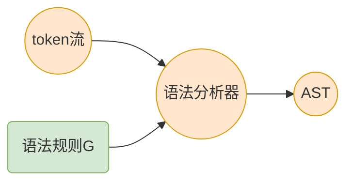

# 上下文无关文法及推导

## 乔姆斯基文法体系

**乔姆斯基文法体系**是计算机科学中刻画[形式文法](https://zh.wikipedia.org/wiki/形式文法)表达能力的一个分类谱系（详见[乔姆斯基文法体系](/计算机科学/乔姆斯基文法体系)）。

**上下文无关文法(*CFG, context-free grammar*)**是其中一个分类。


* 3-型文法：正则文法，用于描述**词法结构**

* 2-型文法：上下文无关文法，用于描述**语法结构**

* 1-型文法：上下文相关文法

* 0-型文法：任意文法

## 一个自然语言例子

自然语言中句子的一个典型结构是`主谓宾结构`，也就是`主语 谓语 宾语`的结构。她实际上是`动词 名词 动词`的顺序结构。

假设有以下名词和动词的集合：

- 名词：{羊， 老虎， 草， 水}
- 动词：{吃， 喝}

忽略现实情况，它们可以组成`羊喝水`等共$4*2*4 = 32$个句子。

### 形式化表示

用`S`表示一个句子，`->`表示推出，`N`表示名词，` V`表示动词。
$$
S \to N \ V \ N \qquad N=\{s, t, g, w\}, \ V=\{e, d\}
$$

```
// 名词 动词 名词
S -> N(noun) V(verb) N(noun)
N -> s(sheep)
   | t(tiger)
   | g(grass)
   | w(water)
V -> e(eat)
   | d(drink)
```

我们将大写符号叫非终结符，小写符号叫终结符，有

* 非终结符：$\{S,N,V\}$
* 终结符：$\{s,t,g,w,e,d\}$
* 开始符号：$S$

*这个例子会在后面的内容中经常用到。*

## 上下文无关文法

上下文无关文法$G$是一个**四元组**：
$$
G = \{N,T,P,S\}
$$

- $N(Non-Terminated)$，非终结符集合

- $T(Terminated)$，终结符集合

- $P$，一组产生式规则集合

  - 每条规则的形式：
    $$
    X \to \beta_1\beta_2\dots\beta_n,\quad n \ge 0, X \in N, \beta_i \in T \cup N
    $$

- $S$是唯一的开始符号，它**必须是非终结符**


### 一个例子

上文`主谓宾结构`的例子，用*CFG*表示，有：

```text
S -> N V N
N -> s
   | t
   | g
   | w
V -> e
   | d
```

* $G = \{N,T,P,S\}$

* 非终结符：$N = \{S,N,V\}$

* 终结符：$T = \{s,t,g,w,e,d\}$

* 开始符号：$S$

* 产生式集合：
  $$
  P = \{S \to NVN,
  N \to s, N \to t, \dots, N \to w, V \to e, V \to d\}
  $$

## 推导

给定文法$G$， 从$G$的开始符号$S$开始，用产生式的右部替换左侧的**非终结符**，此过程不断重复，直到**不出现非终结符**为止。

这个过程称为**推导**，最终得到的串称为**句子**。

依旧是上文的`主谓宾`例子：

```
S -> N V N
N -> s
   | t
   | g
   | w
V -> e
   | d
```

其推导过程为：

```
S -> N V N
  -> N d N
  -> t d N
  -> t d g
```

这个推导过程得到的句子`tdg`只是该文法能推导出的其中一个句子。不难得出，该文法共能推导出32个句子。

### 最左推导 & 最右推导

上节推导过程中，是先替换了中间的非终结符$V$，然后替换另外两个非终结符$N$。

事实上，对非终结符的选取顺序没有严格的限定。对此，我们约定两种选取顺序：

* 最左推导：每次总是选择最左侧的符号进行替换
* 最右推导：每次总是选择最右侧的符号进行替换

**两种推导方式对推导结果没有影响。**

上节推导过程用最左推导过程如下：

```
S -> N V N
  -> t V N
  -> t d N
  -> t d g
```

## 语法分析与CFG

简单来说，语法分析过程之一，就是给定文法$G$和句子$S$，判断$G$是否存在对$S$的推导。



语法分析器的任务之一：从`token流`中获取句子$S$ ，接受`CFG`描述的语法规则$G$，判断$G$是否存在对$S$的推导。

* 如果存在推导，则进行下一步
* 如果不存在，则给出错误提示
