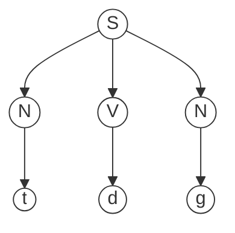
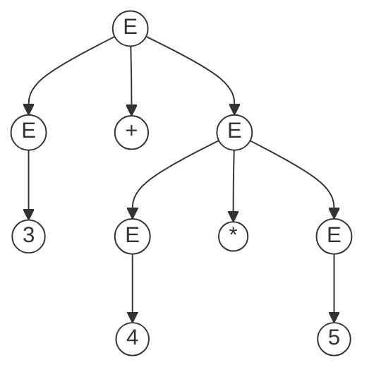
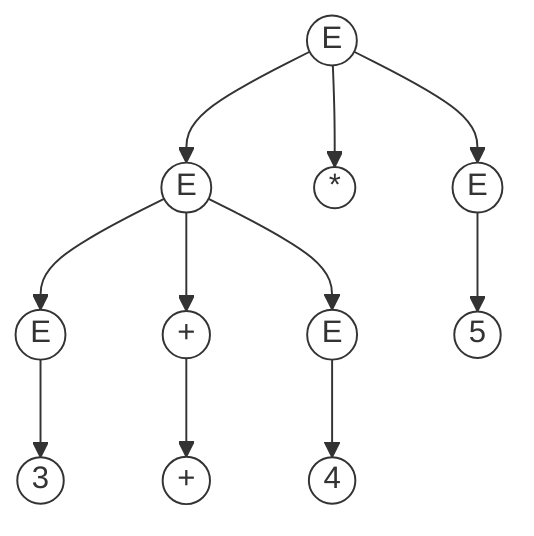
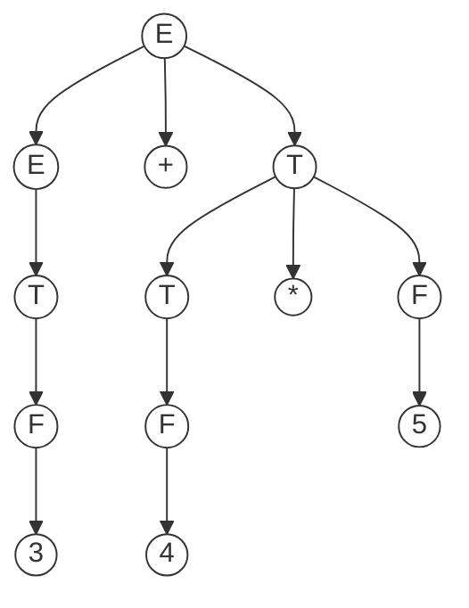

# 分析树和二义性文法

## 分析树

在《上下文无关文法及推导》中，我们给出了一个`主谓宾`的文法和它的一个推导：

```
S -> N V N
N -> s
   | t
   | g
   | w
V -> e
   | d
```

```
S -> N V N
  -> N d N
  -> t d N
  -> t d g
```

我们可以将这个推导过程化成树状图的形式，这棵树就是**分析树**：



**分析树就是用树状结构表示的推导过程**。它和推导所用的顺序无关（最左推导、最右推导或其它）。

分析树特点：

- 内部节点都是非终结符
- 叶子节点都是终结符
- 每一步推导代表从父节点生成它的直接子节点
- 分析树的含义取决于树的**后序遍历**的顺序（后面会提到）

### 算术表达式的例子

给定一个文法$G$，推导出句子`3 + 4 * 5`。$G$表示如下：

```
E -> num
   | id
   | E + E
   | E * E
```

观察文法和句子，显然第一步不能推`num`或`id`，这样推导直接结束了。

第一步可以推`E + E`或`E * E`，下面来分析这两种做法。

#### 先加法后乘法

推导过程如下（使用最左推导）：

```
E -> E + E
  -> 3 + E
  -> 3 + E * E
  -> 3 + 4 * e
  -> 3 + 4 * 5
```



#### 先乘法后加法

推导过程如下（使用最左推导）：

```
E -> E * E
  -> E + E * E
  -> 3 + E * E
  -> 3 + 4 * E
  -> 3 + 4 * 5
```



两种推导方法都能得到句子`3 + 4 * 5`，但是分析树的结构完全不同，因而。

**分析树的含义取决于树的后序遍历的顺序**。

第一棵树的后序遍历计算结果为：3 + (4 * 5) = 23

第二棵树的后序遍历计算结果为：(3 + 4) * 5 = 35

出现这种情况原因是：**文法存在二义性**。

## 二义性

给定一个文法$G$，如果存在句子$S$，它有两棵不同的分析树，那么称$G$为**二义性文法**。

从编译器角度，二义性文法的问题：**同一个程序有不同的含义，程序运行结果不是唯一的**。

解决方案：**文法的重写**。

不存在通用的方法$f$，使得任意二义性文法都能通过$f$改写为非二义性文法。需要具体观察当前文法进行改写。

### 表达式文法的重写

将上述`算术表达式`例子的文法$G$重写为：

```
E -> E + T
   | T
T -> T * F
   | F
F -> num
   | id
```

对句子`3 + 4 * 5`的推导过程为：

```
E -> E + T
  -> T + T
  -> F + T
  -> 3 + T
  -> 3 + T * F
  -> 3 + F * F
  -> 3 + 4 * F
  -> 3 + 4 * 5
```



这棵分析树的后序遍历计算结果为`3 + (4 * 5) = 23`，计算结果正确且分析树唯一。