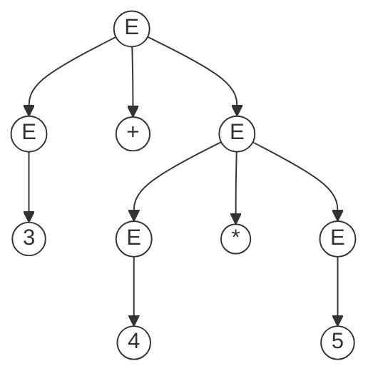
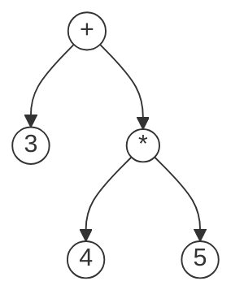

# 语法制导翻译

编译器在语法分析的过程中，除了判断语法是否合法外，还需要完成类型检查、目标代码、中间代码生成等工作。

这些工作称为语法制导翻译，语法制导翻译的产物通常是**抽象语法树（AST）**。

## LR分析的语法制导翻译

语法制导翻译的基本思想：

给每条产生式规则附加一个语义动作，在产生式归约时执行语义动作。语义动作是一个代码片段，通常是抽象语法树的构造函数。

```
1: N -> t_1     action_1(语义动作)
2:    | t_2     action_2
...             ...
n:    | t_n     action_n
```

在LR分析中：

```c
if (action[state, terminal] == 'ri') { // 按第i条产生式归约
  action_i(); // 执行相应的语义动作
  pop(t_i);
  state s = stack[top];
  push(N);
  push(goto[s, N]);
}
```

在分析栈中需要维护一个三元组：`<symbol, value, state>`，其中：

* `symbol`：终结符或非终结符
* `value`：`symbol`所拥有的值
* `state`：当前的分析状态

## 抽象语法树

### 从分析树到抽象语法树

针对`3 + 4 * 5`推导的分析树：




分析树编码了句子的推导过程，但是包含很多不必要的信息，这些信息需要**占用额外的存储空间**且**增加遍历时间**。

比如：

* 对于表达式而言，编译只需要知道运算符和运算数（优先级、结合性等已经在语法分析部分处理掉了）。

* 经过语法分析后，编译器不需要再关心赋值符号是`=`还是`:=`。

抽象语法树会去掉这些不必要的信息，使得针对抽象语法树的算法运行更快且更节约内存。



#### 具体语法和抽象语法

* 具体语法是语法分析器使用的语法

  具体语法适合于语法分析，如各种分隔符、消除左递归、提取公因子等。

* 抽象语法是用来表达语法结构的内部表达形式

  现代编译器一般都采用抽象语法作为前端（词法语法分析）和后端（代码生成）的接口。

### 抽象语法树的数据结构

```c
enum Kind { E_INT, E_ADD, E_TIMES };
struct Exp{
  enum Kind kind;
};
struct Exp_Int {
  enum Kind kind;
  int n;
};
struct Exp_Add {
  enum Kind kind;
  struct Exp* left;
  struct Exp* right;
}
struct Exp_Times {...}
```

### LR分析中生成抽象语法树

在LR分析的**语法动作**中，加入生成语法树的代码片段（通常是语法树的构造函数）。

在**产生式归约**的时候，就会自动调用语法树节点的构造函数，从而自底向上（叶子到根）构造语法树。

```
E -> E + E  { $$ = new Exp_ADD($1, $3) }
   | E * E  { $$ = new Exp_Times($1, $3) }
   | n      { $$ = new Exp_Int($1) }
```

### 抽象语法树保留源代码信息

**抽象语法树是编译器前端和后端的接口，程序一旦被转换成抽象语法树，则源代码即被丢弃，后序阶段只处理抽象语法树。**

所以抽象语法树必须编码足够多的源代码信息，比如每个语法结构在源代码中的位置，包括文件、代码行号列号等，方便后序报错时提供。

因此，**抽象语法树必须仔细设计**。

下面给出一个在抽象语法树中保存代码位置的例子：

```c
struct position {
  char *file;
  int line;
  int column;
}
struct Exp_Add {
  enum Kind kind;
  // ...
  struct position from;
  struct position to;
}
```

