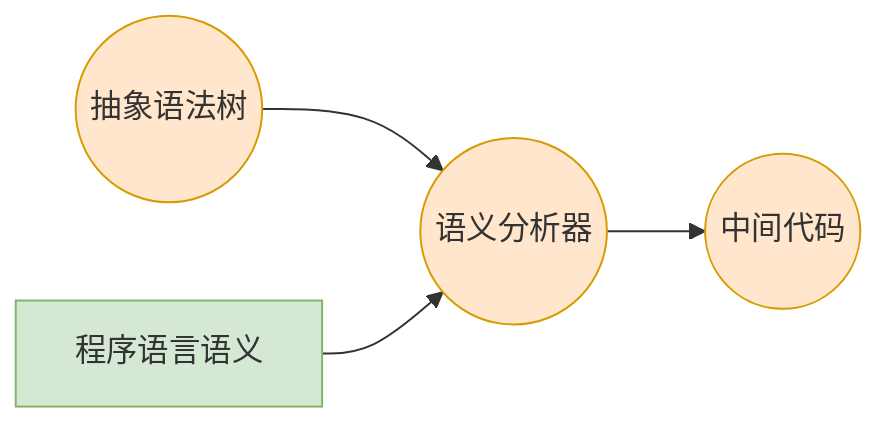

# 语义分析

## 简介

语义分析也称为**类型检查**、**上下文相关分析**。

语义分析负责检查程序（**抽象语法树**）的**上下文相关属性**，**检查内容与具体的源语言相关**，通常包括：

* 变量先声明后使用
* 表达式都有合适的类型
* 函数调用和函数的定义一致
* ...

以下面一段C语言代码为例，其中出现的错误是语义分析要检查的。

```c
void f(int *p) {
  x += 4; // x未声明
  p(23); // p是int指针类型，不能调用
  "hello" + "world"; // C语言中运算符“+”没有重载，不能对字符串操作
}

int main() {
  f() + 5; // 函数f要接受参数，且没有返回值
  break; // 循环体中才能使用break
  return; // main函数返回值为int
}
```

语义分析器在概念上的结构：



总的来说，语义分析器的任务就是：在语法分析得到`AST`后，根据程序语言的语义，检查`AST`中是否有语义错误；如果没有，传递`AST`给下一步；如果有，给出错误信息。

* 经过语法分析后，“缺少分号”等语法错误已经被处理掉，语义分析只需专注于是否有语义错误
* 语义分析需要联系上下文，比如`return`语句要与函数的返回类型匹配，因此又叫上下文相关分析

## 语义规则的实现

举个例子，假设有一个`C--`语言，它只有加法和逻辑与两种表达式运算，它的语法定义为：

```
E -> n
   | true
   | false
   | E + E
   | E && E
```

### 类型检查

对于`C--`语言，类型合法或不合法的程序比如：

```c
// 类型合法
3 + 4;
true && false;

// 类型不合法
3 + true;
true + false;
```

语义分析的任务之一是给出一个函数`Type check(e)`，返回表达式e的类型，如果类型不合法，则报错。

```c
enum Type { INT, BOOL };
Type check(Exp e)
  switch(e -> kind)
    case EXP_INT: return INT;
		case EXP_TRUE, EXP_FALSE: return BOOL;
		case EXP_ADD:
      // AST的结构是 E <-- ADD --> E
      // 这里是递归检查左右子树的类型，类似树的后序遍历
			t1 = check(e -> left);
			t2 = check(e -> right);
			if (t1 != INT || t2 != INT)
        error("type mismatch") // 加法两边类型有非整型，报错
      return INT
    case EXP_AND:
			// ...
```

### 变量声明处理

我们将`C--`语言拓展一下，它包含`程序(Program)`、`声明(Declaration)`、`类型(Type)`、`表达式(Expression)`。文法结构如下：

```
P -> D E
D -> T id; D
   | 
T -> int
   | bool
E -> n
   | id
   | true
   | false
   | E + E
   | E && E
```

此时对于`C--`语言，合法或不合法的程序比如：

```c
// 类型合法
int x; x + 4;
bool y; false && y;

// 类型不合法
x + 3; // x未声明
int x; x + false; // “+”操作的数据类型不合法
```

为了实现对变量声明的检查，需要用到符号表。

符号表的内容下文会介绍，目前只需知道符号表是用于查询的`key - value`字典结构。

```c
enum Type { INT, BOOL }
Table table; // 符号表
Type check_program(Declare d, Exp e)
  // 检查声明和表达式
  check_declare(d)
  return check_exp(e)
Table check_declare(Declare d)
  for(T id in d) // 对每条声明，符号表新增一条记录，检查语句时查询
		table_enter(table, id, T)
Type check_exp(Exp e)
	switch(e -> kind)
    case EXP_ID:
			t = Table_lookup(table, id); // 查询符号表，如果变量没有声明，报错
			if (id not exist)
        error("id not found")
      return t;
```

#### 语句的处理

我们再将`C--`语言拓展一下，使其包含`语句(Statement)。文法结构如下：

```
// program由声明和语句构成
P -> D S
D -> T id; D
	 |
T -> int
   | bool

// 赋值语句和函数调用语句
S -> id = E
   | printi(E)
   | printb(E)
E -> n
   | id
   | true
   | false
   | E + E
   | E && E
```

语句检查的实现伪代码如下：

```c
void check_stm(Table table, Stm s) {
  switch(s->kind)
    case STM_ASSIGN: // 赋值语句
  		t1 = Table_lookup(s->id)
      t2 = check_exp(table, s->exp)
      if (t1 != t2) // 变量的声明和赋值需要是同一类型
        error("type mismatch")
      return INT
    case STM_PRINTI:
  		t1 = check_exp(s->exp)
      if (t1 != INT) // printi只能接受int类型
        error("type mismatch")
        
    case STM_PRINTB:
}
```

## 符号表

上文提到的表达式类型检查、变量声明、语句处理等都需要用到符号表作查询。因此，**符号表的实现是语义检查的核心数据结构**。

**符号表是用来存储程序中变量相关信息**，包括

* 类型
* 作用域
* 访问控制信息
* ...

**符号表必须非常高效**，因为程序中的变量规模会很大。

### 符号表的数据结构和实现

从整体来看，符号表主要有的接口函数包括创建、新增、查询等。

```c
#ifndef TABLE_H
#define TABLE_H
typedef ... Table_t; // 符号表的数据结构

Table_t Table_new(); // 新建符号表
void Table_enter(Table_t, Key_t, Value_t); // 符号表插入一条数据
Value_t Table_lookup(Table_t, Key_t); // 符号表的查找
#endif
```

符号表可以用多种数据结构实现，可以根据需要选择。符号表是典型的`key -> value`字典结构。

```c
typedef char *key;
typedef struct value {
  Type_t type; // 类型
  Scope_t scope; // 作用域
  // ...
} value;
```

整个符号表可以抽象成以下这张表格：

| 变量 \ 映射 | type | scope | ...  |
| :---------: | :--: | :---: | :--: |
|      x      | INT  |   0   | ...  |
|      y      | BOOL |   1   | ...  |
|     ...     | ...  |  ...  | ...  |

高效的实现符号表，主要考虑两点：时间复杂度和空间复杂度，需要根据具体情况权衡。下面是常见的两种数据结构：

* 使用哈希表等，查找时间复杂度为O(1)，占用空间大
* 使用红黑树等平衡树，查找时间复杂度为O(lg N)，节约空间

### 符号表处理作用域

考虑以下代码的作用域：

```c
int x; // scope 0
int f() {
  if (4) {
    int x; // scope 2
    x = 6;
  } else {
    int x; // scope 2
    x = 5;
  }
  x = 8; // scope 1
}
```

用符号表处理作用域，可以有以下两种方法：

* 全局只使用一张符号表
  * 进入作用域时插入元素
  * 退出作用域时删除元素
* 采用符号表构成的栈
  * 进入作用域时插入新的符号表
  * 退出作用域时删除栈顶符号表

### 符号表处理命名空间

考虑以下代码：

```c
struct list {
  int x;
  struct list* list;
} *list;

void walk(struct list* list) {
  list: // label
  	printf("%d\n", list -> x); // 指针list
    if (list = list -> list) // 结构体内的list
      goto list; // 跳转到label位置
}
```

上面代码中，`list`出现了很多次，如何区分每个`list`就是命名空间要解决的问题。

解决办法就是：**每个命名空间用一个表来处理**。

## 其他问题

* 类型相容性

  类型检查的问题往往归结为判断两个类型是否相等`t1 == t2`，然而要判断是否相等是很复杂的问题。

  * 名字相等 VS 结构相等
  * 面向对象的继承，需要维护类型间的继承关系

* 错误诊断

  * 要给出尽可能准确、尽可能多的错误信息

  * 准确的出错位置。程序代码的位置信息要从前端保留并传递过来

* 代码翻译

  现代的编译器中的语义分析模块，除了做语义分析外，还要负责生成中间代码或目标代码。

  代码生成的过程也是对树的某种遍历过程。

  因此，语义分析模块往往是编译器中最庞大也最复杂的模块。

