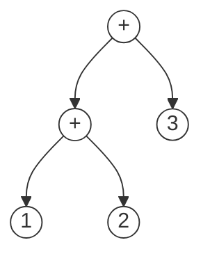

# 代码生成

代码生成负责把源程序翻译成“目标机器”上的代码。目标机器可以是

* 真实的物理机器，比如x86、arm等CPU架构的机器
* 虚拟机，比如JVM

生成的代码主要有两个重要任务：

* 给源程序的**数据**分配**计算资源**

  **数据**包括全局变量、局部变量、动态分配内存等。**计算资源**包括寄存器、数据区、代码区、栈区、堆区。

  代码生成需要根据程序的特点和编译器的设计目标合理的为数据分配计算资源。比如函数调用的数据通常放在栈中，动态分配的内存通常在堆中分配。

* 给源程序的**代码**选择**指令**

  **代码**包括表达式运算、语句、函数等。**指令**通常包括算术运算、比较、跳转、函数调用、返回等。

## 栈计算机

栈式计算机在历史上非常流行，但是由于**效率问题**现今已基本退出历史舞台。

我们还要讨论栈式计算机的代码生成主要有两个原因：

* 得益于栈计算机的简单结构，对栈计算机的代码生成是最容易的
* 仍有许多栈式的虚拟机，比如JVM

### 栈计算机Stack的结构

栈计算机Stack主要由以下几部分组成：

* 内存Memory：存放所有的变量
* 栈Stack：进行运算的空间
* 算术逻辑单元ALU：执行指令


### 栈计算机的指令集(ISA)

栈计算机的ISA用上下文无关文法(CFG)表示如下：

```
s -> push NUM
   | load x
   | store x
   | add
   | sub
   | times
   | div
```

* `push NUM`：栈操作，将一个立即数压入栈
* `load / store`：访存操作，将一个数从内存压入栈或将栈顶元素出栈并保存到内存中
* `add / sub / times / div`：算术运算

指令的语义：

```assembly
push NUM:
	top++;
	stack[top] = NUM;
load x:
	top++;
	stack[top] = x;
store x:
	x = stack[top];
	top--;
add:
	temp = stack[top - 1] + stack[top];
	top -= 2;
	push temp;
sub,times,div: // ...
```

Stack机器只支持`int`一种数据类型，给变量`x`分配内存的伪指令是：

```
.int x
```

Stack机器在装载一个程序时，就会读取伪指令，给相关变量分配内存。

### 一个例子

假设有如下源代码：

```c
int x; int y; int z;

x = 10;
y = 5;
z = x + y;
y = z * x;
```

生成的指令如下：

```assembly
// 分配内存
.int x
.int y
.int z

// x = 10
push 10
store x
// y = 5
push 5
store y
// z = x + y
push x
push y
add
store z
// y = z * x
load z
load x
times
store y
```

### 面向栈计算机的代码生成

上面的例子介绍了代码生成的结果是怎样的，下面介绍如何生成代码。

在语义分析中我们提到了`C--`语言，它的文法结构如下：

```
P -> D S
D -> T id; D
	 |
T -> int
   | bool
S -> id = E
   | printi(E)
   | printb(E)
E -> n
   | id
   | true
   | false
   | E + E
   | E && E
```

面向栈计算机的代码生成要做的就是：将`C--`程序代码翻译成栈计算机可以执行的指令序列。我们可以用递归下降的代码生成算法完成这个工作，它大概包含以下几个函数：

```c
Gen_P(D, S);
Gen_D(T id, D);
Gen_T(T);
Gen_S(S);
Gen_E(E);
```

#### 表达式

在生成表达式代码的`Gen_E`中，需要保证的不变式：表达式的值总在栈顶。

`Gen_E`的伪代码实现：

```c
Gen_E(E e) {
  switch(e) {
    case n: emit("push n"); break;
    case id: emit("load id"); break;
    case true: emit("push 1"); break;
    case false: emit("push 0"); break;
    case e1 + e2:
      Gen_E(e1); Gen_E(e2);
      emit("add");
      break;
    case ...
  }
}
```

#### 语句

在生成语句代码的`Gen_S`中，需要保证的不变式：栈的规模不变。

`Gen_S`的伪代码实现：

```c
Gen_S(S s) {
  switch(s) {
    case id = e: // 赋值语句
      Gen_E(e); emit("store id");
      break;
    case printi(e): // 函数调用
      Gen_E(e); emit("printi");
      break;
		case ...
  }
}
```

#### 类型、变量声明、程序

生成类型、变量声明、程序的不变式：只生成`.int`类型。

```c
Gen_T(T t) {
  switch(t) {
    case int: emit(".int"); break;
    case bool: emit(".int"); break;
  }
}

Gen_D(T id, D) {
  Gen_T(T);
  emit("id");
  Gen_D(D);
}

Gen_P(D, S) {
  Gen_D(D);
  Gen_S(S);
}
```

### 运行生成的代码

* 使用一台真实的物理机
* 写一个类似JVM的虚拟机（解释器）
* 在非栈式计算机上进行模拟，比如用x86的调用栈模拟

## 寄存器计算机

寄存器计算机是目前最流行的计算机体系结构之一。它运行效率高且体系结构规整。

寄存器计算机通常有16、32或更多个的寄存器，所有操作都在寄存器中进行；内存不能直接运算，通过load / store指令进行访存操作。

### 寄存器计算机Reg的结构

与栈计算机类似，寄存器计算机由内存、寄存器、ALU组成。


### 寄存器计算机Reg的指令集

```
s -> movn n, r
   | mov r1, r2
   | load [x], r
   | store r, [x]
   | add r1, r2, r3
   | sub r1, r2, r3
   | times r1, r2, r3
   | div r1, r2, r3
```

* 数据移动
  * `movn n, r`：将立即数`n`放入寄存器`r`
  * `mov r1, r2`：将寄存器`r1`的值复制到寄存器`r2`
* 访存操作，`load / store [x], r`：将内存中`x`的值加载到寄存器或相反
* 算术运算，`add r1, r2, r3`：将`r1, r2`的值相加，结果写入`r3`

在代码生成的阶段，假设Reg机器上有无限多个寄存器。

每个声明变量和临时变量都会占用一个虚拟寄存器，把虚拟寄存器分配到物理寄存器的过程称为**寄存器分配**。

### 面向寄存器计算机的代码生成

与栈式计算机类似，面向寄存器计算机的递归下降代码生成如下：

```c
void Gen_P(D, S);
void Gen_D(T id, D);
void Gen_T(T);
void Gen_S(S);
Reg Gen_E(E);
```

```c
Reg Gen_E(E e) {
  switch(e) {
    case n:
      r = fresh(); emit("move n, r");
      return r;
    case id:
      r = fresh(); emit("mov id, r");
      return r;
    case e1 + e2:
      r1 = Gen_E(e1); r2 = Gen_E(e2); r3 = fresh(); emit("add r1, r2, r3");
      return r3;
    case e1 && e2:
    //...
  }
}

// ...
```

### 寄存器计算机的例子

有如下代码：

```c
int x;
x = 1 + 2 + 3;
```

这段代码对应的AST大概如下：



代码生成后的结果：

```assembly
.int x

moven 1, r1;
moven 2, r2;
add r1, r2, r3; // r3 = 1 + 2
moven 3, r4;
add r3, r4, r5;
```

### 运行代码

要运行面向寄存器计算机的生成代码，可以

* 写一个虚拟机（解释器）
* 在真实的物理机上运行，需要进行寄存器分配
