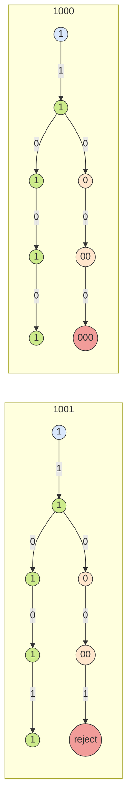

# 有限状态机

## 简介

有限状态机是表示**有限个状态**以及在这些状态之间的**转移和动作**等行为的**数学计算模型**。

有限状态机（*finite-state machine*，**FSM**）又称**有限状态自动机**（*finite-state automation*，**FSA / FA**），简称**状态机**。

状态机又可以分为**确定型**和**非确定型**：

* 确定有限自动机（*Deterministic Finite Automaton*，**DFA**）
* 非确定有限自动机（*Nondeterministic Finite Automaton*， **NFA**）

*状态机相关简称较多，本文使用：有限状态机（FSM）、DFA、NFA。*

FSM有两个特殊状态：

* **开始状态**：通常用“没有起点的箭头”指向它来表示

* **接受状态**：状态图中通常将其标示为双圆圈。

以下是FSM的一个例子：判断一个二进制串是否含有偶数个0，其中$S1$**既是开始状态也是接受状态**。

比如字符串`1010`、`01101`、`1111`会使FSM处于接受状态，`1110`、`1000`会使FSM处于$S2$状态。


状态机有以下几个特点：

* 状态总数（state）是有限的
* 任一时刻，只处在一种状态之中
* 某种条件下，会从一种状态转变（transition）到另一种状态

## 数学模型

有限状态机可以用一个五元组$(\Sigma,S,s_0,\delta,F)$表示，其中：

* $\Sigma$是字母表（符号的非空有限集合）
* $S$是状态的非空有限集合
* $s_0$是初始状态，它是$S$的元素。在`NFA`中，$s_0$是初始状态的集合
* $\delta$是状态转换函数
* $F$是最终状态的集合，也是$S$（可能为空）的子集

对上述`二进制串是否含有偶数个0`的例子来说：

* $\Sigma = {0, 1}$

* $S = \{s_1, s_2\}, s_0 = s_1, F = \{s_2\}$

* $\delta$状态转换函数：

  ```
  {
  	(s1, 0) -> s2
  	(s1, 1) -> s1
  	(s2, 0) -> s1
  	(s2, 1) -> s2
  }
  ```

状态和字符转换表：

| 状态 \ 字符 | 0    | 1    |
| ----------- | ---- | ---- |
| **s1**      | s2   | s1   |
| **s2**      | s1   | s2   |

*可以用邻接矩阵或邻接表来表示一个FSM。*

## FSM的例子

### 被3整除二进制数

求一个能FSM：判断一个二进制数能否被3整除

**一个数能否被整除，关键看余数是否为0。**

一个数除以3，余数可能为`0、1、2`，所以有`0、1、2`三种状态，其中`0`是开始状态也是接受状态。

回忆下二进制转十进制的公式，比如$101(b) = 1 * 2^2 + 0 * 2^1 + 1 * 2^0 = 5$。

设二进制位从高位到低位进入FSM，令当前状态为$s$，当前已判断的字符组成数字$d$，下一位字符为$c$

* 如果$s = 0$，即当前$d$能被3整除，比如$0$、$110(b)$
  * $c = 0$，相当于乘以$d * 2$，仍能被3整除
  * $c = 1$，相当于$d * 2 + 1$，余数为1
* 如果$s = 1$，即 $d \:mod \: 3 = 1$
  * $c = 0$，相当于$d * 2$，余数为2
  * $c = 1$，相当于$d * 2 + 1$，余数为0
* 如果$s = 2$，即 $d \:mod \: 3 = 2$
  * $c = 0$，相当于$d * 2$，余数为1
  * $c = 1$，相当于$d * 2 + 1$，余数为2


### 被8整除二进制数

求一个能FSM：判断一个二进制数能否被8整除

这个问题比上一个问题简单。事实上，判断二进制数能否被偶数整除要比判断奇数简单。

比如，判断二进制数被2整除，**只需要末位为0**。由此类比，判断能否被8整除只需要**末3位都为0**（$2 ^ 3 = 8$）。

在FSM中，凡是遇到`1`，则转到`状态1`，遇到连续的3个0则暂时转到接受状态`000`


**同一个问题，可以有不同的 FSM 处理。** 我们要努力追寻那些状态最少的 FSM。

## DFA & NFA

前面提到的FSM，**给定一个状态和输入，可以确定地转换到下一个状态**，它们被称为**确定有限自动机（DFA）**。

与DFA相对的，**非确定有限自动机（NFA），给定一个状态和输入，无法确定地转换到下一个状态**。

### 一个NFA的例子

上面`被8整除二进制数`的例子，也可以用下面这个FSM表示：

不管一开始接受什么字符，最后三个必须是0。


这就引出一个问题，如果当前`状态1`，下一个字符为`0`，那么应该转到`状态0`还是保持为`状态1`呢？

这里我们需要用到**决策树(*decision tree*)**

> 在有歧义的地方分裂出多条路径，当所有路径都结束（数据处理完全或在停某个状态无法继续处理），只要有一条路径到达接受状态，这个输入就满足 NFA。

比如 1000 和 1001 这两个输入：



事实上，这样的处理效率上并非最优，**决策树上的路径会随着带有不确定性的状态的数量指数增长**。

所以，大部分时候我们要把 **NFA 转化成 DFA，再把 DFA 转化成最小 DFA**。详见[RE->NFA->DFA->最小DFA](../RE->NFA->DFA->最小DFA)

### 小结

* 确定状态有限自动机 DFA

  对任意的字符，最多有一个状态可以转移：$\delta: S \times \Sigma \to S$


- 非确定有限状态自动机 NFA

  对任意的字符，有多于一个状态可以转移：$\delta:S \times (\Sigma \cup \epsilon) \to \varphi(S)$，$\varphi(S)$为$S$的幂集。

## 参考

[谈谈状态机](https://zhuanlan.zhihu.com/p/28142401)

[有限状态机](https://zh.wikipedia.org/wiki/%E6%9C%89%E9%99%90%E7%8A%B6%E6%80%81%E6%9C%BA#%E6%95%B0%E5%AD%A6%E6%A8%A1%E5%9E%8B)

[编译原理](https://mooc.study.163.com/course/1000002001?tid=2403024009)
